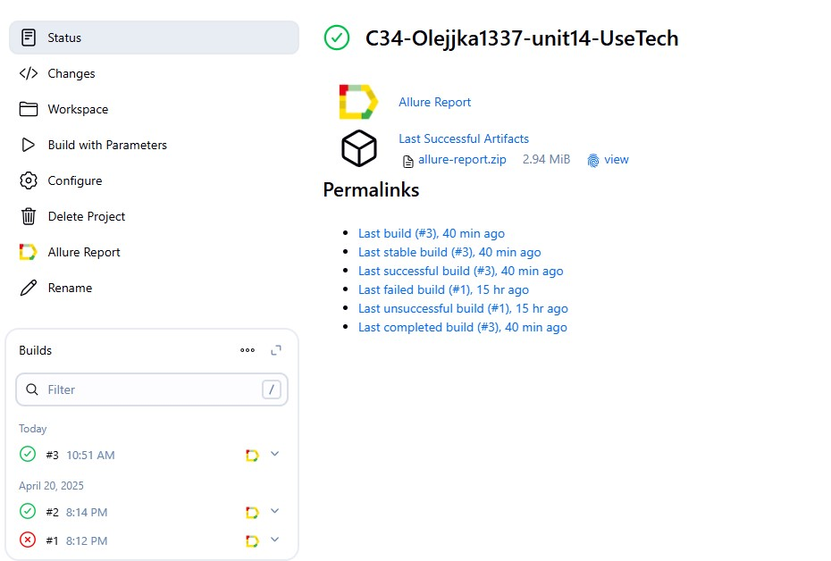

<p align="center">
  <a href="https://freedom-travel.kz/">
    
  </a>
</p>

<h1 align="center">Проект по автоматизации тестирования для компании <a href="https://freedom-travel.kz/">Aviata</a></h1>

---

## ☑️ Содержание

- [Технологии и инструменты](#tools)
- [Реализованные проверки](#cases)
- [Сборка в Jenkins и запуск из терминала](#jenkins)
- [Allure-отчёт](#allure)
- [Уведомление в Telegram](#telegram)
- [Примеры видео выполнения тестов](#video)

---

<a id="tools"></a>
## 🛠️ Технологии и инструменты

| Java | IntelliJ IDEA | GitHub | JUnit 5 | Gradle | Selenide | Selenoid | Allure Report | Jenkins | Telegram |
|:----:|:-------------:|:------:|:-------:|:------:|:--------:|:--------:|:-------------:|:-------:|:--------:|
|  |  |  |  |  |  |  |  |  |  |

---

<a id="cases"></a>
## ✅ Реализованные проверки

- Проверка количества кнопок в header меню на главной странице.
- Переход на страницу **Новости** и проверка заголовка "Новости".
- Переход на страницу **Контакты** и проверка заголовка "Контакты".
- Переход на страницу **Продукты** и проверка заголовка "Продукты".
- Переход на страницу **Награды** и проверка заголовка "Награды".

---

<a id="jenkins"></a>
## 🧩 Сборка в [Jenkins](https://jenkins.autotests.cloud/job/C34-Olejjka1337-unit14-UseTech/)

<p align="center">
  
</p>

### ⚙️ Параметры сборки

- `browser` — браузер (по умолчанию `chrome`)
- `browserVersion` — версия браузера (по умолчанию `127.0`)
- `browserSize` — размер окна (по умолчанию `1920x1080`)

### 🔧 Команды для запуска из терминала

**Локальный запуск**
```bash
gradle clean UseTech
